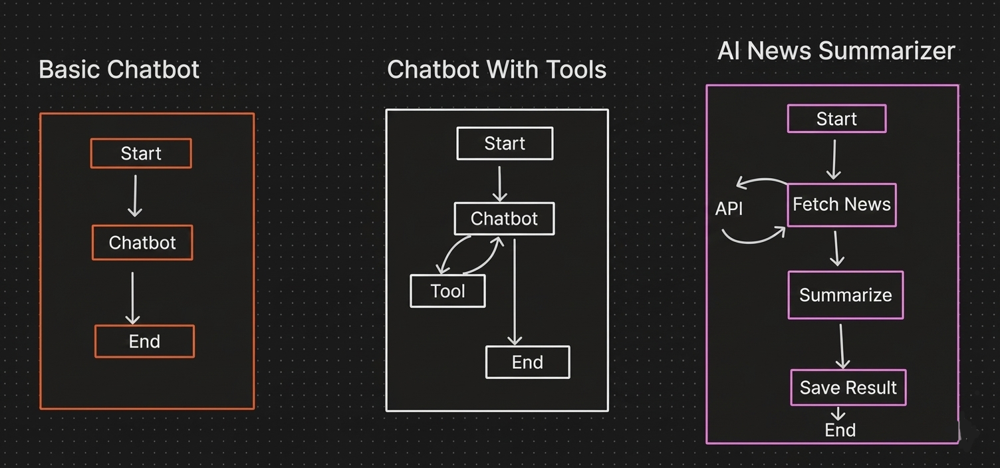

# 🚀 LangGraph Agentic AI Platform

An **Agentic AI application** built using **LangChain**, **LangGraph**, **Groq LLM**, **Tavily API**, and **Streamlit**.  
This project demonstrates how modern AI systems move beyond simple chatbots into **graph-driven, tool-aware, multi-step AI workflows**.

---

## 🧠 Project Overview

Most traditional chatbots follow a linear flow:

This project implements **Agentic AI**, where the system can:

- Decide the next action dynamically  
- Call external tools and APIs  
- Execute multi-step workflows  
- Maintain state across steps  
- Follow conditional and looping paths  

All workflows are orchestrated using **LangGraph**, which models AI behavior as **stateful graphs**, enabling scalable and production-ready AI systems.

---

## 🧩 Implemented Agentic Workflows

This project includes **three core agentic workflows**, all implemented using **LangGraph**.

### 1️⃣ Basic Chatbot
A simple conversational AI that validates:
- LLM integration
- Streamlit UI interaction
- End-to-end request–response flow

**Purpose**
- Foundation for agentic systems  
- Baseline conversational capability  

---

### 2️⃣ Chatbot with Tools
An intelligent agent that can:
- Decide when to respond directly
- Decide when to invoke a tool
- Use tool output to generate a final response

**Purpose**
- Demonstrates tool calling
- Shows agent reasoning and decision-making
- Introduces non-linear execution paths

---

### 3️⃣ AI News Summarizer
A real-world automated agent pipeline that:
- Fetches live news using Tavily API
- Summarizes content using Groq LLM
- Saves and displays the result

**Purpose**
- Real-time external data usage
- Multi-step AI automation
- Practical agentic use case

---

## 🖼️ Agentic Workflow Architecture

The image below represents all three workflows implemented using **LangGraph**:



This diagram clearly shows:
- Linear chatbot flow  
- Tool-based agent interaction  
- API-driven multi-step automation  


## ⚙️ End-to-End Execution Flow

1. Streamlit UI loads and collects user input  
2. User selects a specific use case  
3. Groq LLM is initialized dynamically  
4. LangGraph builds the workflow graph  
5. The graph executes node-by-node  
6. Tools and APIs are invoked when required  
7. Final results are displayed in the UI  

Robust exception handling ensures reliability at every stage.

---

## ▶️ How to Run the Application

### 1️⃣ Install Dependencies
```bash
pip install -r requirements.txt

### 2️⃣ Run the Application
```bash
streamlit run app.py